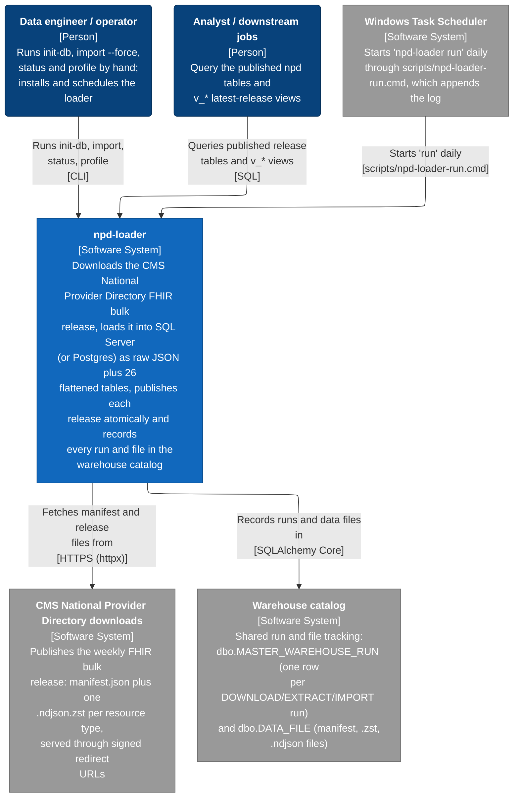
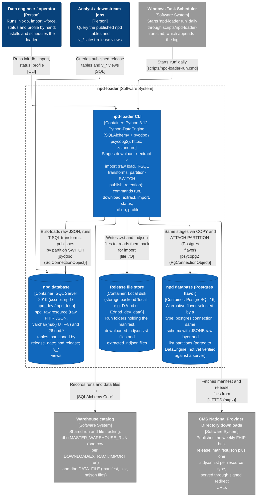
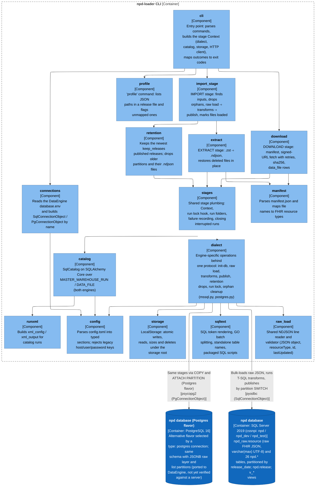
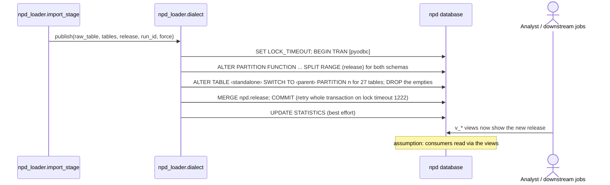

# Architecture Report

## Repository Information

**Repository Name:** nppes_npd_env

**Technology Stack:**

- Python

---

## Executive Summary

nppes_npd_env has 17 projects (16 production, 1 test) with 57 project references between them. The analysis found 1 concern(s).

---

[//]: # (c4:start)

## Architecture (C4 model)

Downloads the CMS National Provider Directory FHIR bulk release, loads it into SQL Server (or Postgres) as raw JSON plus 26 flattened tables, publishes each release atomically and records every run and file in the warehouse catalog

### Level 1: System context

### Level 2: Containers

| Container | Technology | Responsibility | Code |
|---|---|---|---|
| **npd-loader CLI** (container) | Python 3.12, Python-DataEngine (SQLAlchemy + pyodbc / psycopg2), httpx, zstandard | Stages download -> extract -> import (raw load, T-SQL transforms, partition-SWITCH publish, retention); commands run, download, extract, import, status, init-db, profile | `.` |
| **npd database** (data store) | SQL Server 2019 (cssnpi: npd / npd_dev / npd_test) | npd_raw.resource (raw FHIR JSON, varchar(max) UTF-8) and 26 npd.* tables, partitioned by release_date; npd.release; v_* views | — |
| **npd database (Postgres flavor)** (data store) | PostgreSQL 16 | Alternative flavor selected by a type: postgres connection; same schema with JSONB raw layer and list partitions (ported to DataEngine, not yet verified against a server) | — |
| **Warehouse catalog** (data store) | SQL Server (HIE_WAREHOUSE_META / HIE_WAREHOUSE_META_DEV) | Shared run and file tracking: dbo.MASTER_WAREHOUSE_RUN (one row per DOWNLOAD/EXTRACT/IMPORT run) and dbo.DATA_FILE (manifest, .zst, .ndjson files) | — |
| **Release file store** (data store) | Local disk (storage backend 'local', e.g. D:\npd or E:\npd_dev_data) | Run folders holding the manifest, downloaded .ndjson.zst files and extracted .ndjson files | — |

### Level 3: Components

For each container: the modules it is built from (when it has several), then the code structure inside them (packages or namespaces and the imports between them).

#### npd-loader CLI

> 21 of 41 dependencies are hidden because a longer path already shows them (A → C is left out when A → B → C is drawn). The full list is in the dependency graph appendix.

### Key flows

How a request moves through the system, step by step.

#### Scheduled daily run (download, extract, import)

From Task Scheduler to a published release; the import extracts first if .ndjson files are missing.

```mermaid
sequenceDiagram
    participant task_scheduler as Windows Task Scheduler
    participant npd_loader_cli as npd_loader.cli
    participant npd_loader_download as npd_loader.download
    participant cms_npd as CMS National Provider Directory downloads
    participant file_storage as Release file store
    participant catalog_db as Warehouse catalog
    participant npd_loader_import_stage as npd_loader.import_stage
    participant npd_loader_extract as npd_loader.extract
    participant npd_loader_dialect as npd_loader.dialect
    participant db_sql_server as npd database
    participant npd_loader_retention as npd_loader.retention
    task_scheduler->>npd_loader_cli: npd-loader --config ... run [npd-loader-run.cmd]
    npd_loader_cli->>npd_loader_download: run_download(ctx)
    npd_loader_download->>cms_npd: GET manifest.json, then each .ndjson.zst via signed URL [HTTPS]
    npd_loader_download->>file_storage: Writes files into run_‹id›_‹timestamp›/
    npd_loader_download->>catalog_db: DOWNLOAD run + manifest/.zst DATA_FILE rows [SQLAlchemy Core]
    npd_loader_cli->>npd_loader_import_stage: run_import(ctx)
    npd_loader_import_stage->>npd_loader_extract: Extracts missing .ndjson (EXTRACT run)
    npd_loader_import_stage->>npd_loader_dialect: load_raw -› run_transforms -› publish
    npd_loader_dialect->>db_sql_server: Raw batches (5,000 rows, committed each), parse-once T-SQL transforms, SPLIT + SWITCH publish in one transaction [pyodbc]
    npd_loader_import_stage->>npd_loader_retention: apply_retention (keep_releases)
    npd_loader_import_stage->>catalog_db: IMPORT run Success + per-table row counts#59; DATE_LOADED on .ndjson rows [SQLAlchemy Core]
```

#### Atomic publish of a release (SQL Server)

Standalone per-release tables become visible to readers in one metadata-only transaction.

### Configuration

| Variable | Default | Used by | Declared in |
|---|---|---|---|
| `NPD_LOADER_CONFIG` | — | npd-loader CLI | `src/npd_loader/cli.py:29` |

### Technology inventory

Runtime, frameworks and key libraries declared in each container's build files.

| Container | Declared |
|---|---|
| **npd-loader CLI** | `Python >=3.12`, `Python-DataEngine>=2.4`, `zstandard>=0.22`, `httpx>=0.27` |

### Assumptions

Not backed by code evidence; confirm with the team:

- **Analyst / downstream jobs**: Query the published npd tables and v_* latest-release views
- **data-consumer → db-sql-server**: Queries published release tables and v_* views

### C4 files

- [c4-context.mmd](c4-context.mmd)
- [c4-container.mmd](c4-container.mmd)
- [c4-component-npd-loader.mmd](c4-component-npd-loader.mmd)
- [c4-flow-daily-run.mmd](c4-flow-daily-run.mmd)
- [c4-flow-publish.mmd](c4-flow-publish.mmd)
- [c4-facts.json](c4-facts.json)
- [c4-model.json](c4-model.json)

[//]: # (c4:end)

---

## Architectural Observations

### Strengths

- No circular project references.
- Projects with no project references (the core that the rest builds on): npd_loader.config, npd_loader.manifest, npd_loader.profile, npd_loader.raw_load, npd_loader.runxml, npd_loader.sqltext, npd_loader.storage.
- Every production project is referenced by a test project.

### Concerns

- Test projects that reference more than one production project (check whether unit and integration tests are mixed): tests.

---

## Recommendations

- Keep each test project focused on one layer, and move cross-layer tests to a dedicated integration test project.

---

## Appendix: Project Dependency Graph

Every project or module and every reference between them, tests included. The automated checks above (cycles, stray projects, untested projects) are based on this graph.

**Solutions / build roots:** none found

**Project folders:** src

```mermaid
graph TD
    tests["tests"]
    subgraph group_src["src"]
        npd_loader_catalog["npd_loader.catalog"]
        npd_loader_cli["npd_loader.cli"]
        npd_loader_config["npd_loader.config"]
        npd_loader_connections["npd_loader.connections"]
        npd_loader_dialect["npd_loader.dialect"]
        npd_loader_download["npd_loader.download"]
        npd_loader_extract["npd_loader.extract"]
        npd_loader_import_stage["npd_loader.import_stage"]
        npd_loader_manifest["npd_loader.manifest"]
        npd_loader_profile["npd_loader.profile"]
        npd_loader_raw_load["npd_loader.raw_load"]
        npd_loader_retention["npd_loader.retention"]
        npd_loader_runxml["npd_loader.runxml"]
        npd_loader_sqltext["npd_loader.sqltext"]
        npd_loader_stages["npd_loader.stages"]
        npd_loader_storage["npd_loader.storage"]
    end
    npd_loader_catalog --> npd_loader_config
    npd_loader_catalog --> npd_loader_runxml
    npd_loader_cli --> npd_loader_catalog
    npd_loader_cli --> npd_loader_config
    npd_loader_cli --> npd_loader_connections
    npd_loader_cli --> npd_loader_dialect
    npd_loader_cli --> npd_loader_download
    npd_loader_cli --> npd_loader_extract
    npd_loader_cli --> npd_loader_import_stage
    npd_loader_cli --> npd_loader_profile
    npd_loader_cli --> npd_loader_stages
    npd_loader_cli --> npd_loader_storage
    npd_loader_connections --> npd_loader_config
    npd_loader_dialect --> npd_loader_config
    npd_loader_dialect --> npd_loader_raw_load
    npd_loader_dialect --> npd_loader_sqltext
    npd_loader_dialect --> npd_loader_storage
    npd_loader_download --> npd_loader_catalog
    npd_loader_download --> npd_loader_manifest
    npd_loader_download --> npd_loader_runxml
    npd_loader_download --> npd_loader_stages
    npd_loader_extract --> npd_loader_catalog
    npd_loader_extract --> npd_loader_manifest
    npd_loader_extract --> npd_loader_runxml
    npd_loader_extract --> npd_loader_stages
    npd_loader_extract --> npd_loader_storage
    npd_loader_import_stage --> npd_loader_catalog
    npd_loader_import_stage --> npd_loader_dialect
    npd_loader_import_stage --> npd_loader_extract
    npd_loader_import_stage --> npd_loader_manifest
    npd_loader_import_stage --> npd_loader_raw_load
    npd_loader_import_stage --> npd_loader_retention
    npd_loader_import_stage --> npd_loader_runxml
    npd_loader_import_stage --> npd_loader_stages
    npd_loader_retention --> npd_loader_dialect
    npd_loader_retention --> npd_loader_stages
    npd_loader_stages --> npd_loader_catalog
    npd_loader_stages --> npd_loader_config
    npd_loader_stages --> npd_loader_dialect
    npd_loader_stages --> npd_loader_runxml
    npd_loader_stages --> npd_loader_storage
    tests --> npd_loader_catalog
    tests --> npd_loader_cli
    tests --> npd_loader_config
    tests --> npd_loader_connections
    tests --> npd_loader_dialect
    tests --> npd_loader_download
    tests --> npd_loader_extract
    tests --> npd_loader_import_stage
    tests --> npd_loader_manifest
    tests --> npd_loader_profile
    tests --> npd_loader_raw_load
    tests --> npd_loader_retention
    tests --> npd_loader_runxml
    tests --> npd_loader_sqltext
    tests --> npd_loader_stages
    tests --> npd_loader_storage
```

Full dependency graph

### Components

| Project | Ecosystem | Folder | Kind | Depends on | Used by |
|---|---|---|---|---|---|
| npd_loader.catalog | Python | src | production | 2 | 6 |
| npd_loader.cli | Python | src | production | 10 | 1 |
| npd_loader.config | Python | src | production | 0 | 6 |
| npd_loader.connections | Python | src | production | 1 | 2 |
| npd_loader.dialect | Python | src | production | 4 | 5 |
| npd_loader.download | Python | src | production | 4 | 2 |
| npd_loader.extract | Python | src | production | 5 | 3 |
| npd_loader.import_stage | Python | src | production | 8 | 2 |
| npd_loader.manifest | Python | src | production | 0 | 4 |
| npd_loader.profile | Python | src | production | 0 | 2 |
| npd_loader.raw_load | Python | src | production | 0 | 3 |
| npd_loader.retention | Python | src | production | 2 | 2 |
| npd_loader.runxml | Python | src | production | 0 | 6 |
| npd_loader.sqltext | Python | src | production | 0 | 2 |
| npd_loader.stages | Python | src | production | 5 | 6 |
| npd_loader.storage | Python | src | production | 0 | 5 |
| tests | Python | - | test | 16 | 0 |

### Dependency Analysis

### npd_loader.catalog
- depends on npd_loader.config
- depends on npd_loader.runxml
- used by npd_loader.cli, npd_loader.download, npd_loader.extract, npd_loader.import_stage, npd_loader.stages, tests

### npd_loader.cli
- depends on npd_loader.catalog
- depends on npd_loader.config
- depends on npd_loader.connections
- depends on npd_loader.dialect
- depends on npd_loader.download
- depends on npd_loader.extract
- depends on npd_loader.import_stage
- depends on npd_loader.profile
- depends on npd_loader.stages
- depends on npd_loader.storage
- used by tests

### npd_loader.config
- no project references
- used by npd_loader.catalog, npd_loader.cli, npd_loader.connections, npd_loader.dialect, npd_loader.stages, tests

### npd_loader.connections
- depends on npd_loader.config
- used by npd_loader.cli, tests

### npd_loader.dialect
- depends on npd_loader.config
- depends on npd_loader.raw_load
- depends on npd_loader.sqltext
- depends on npd_loader.storage
- used by npd_loader.cli, npd_loader.import_stage, npd_loader.retention, npd_loader.stages, tests

### npd_loader.download
- depends on npd_loader.catalog
- depends on npd_loader.manifest
- depends on npd_loader.runxml
- depends on npd_loader.stages
- used by npd_loader.cli, tests

### npd_loader.extract
- depends on npd_loader.catalog
- depends on npd_loader.manifest
- depends on npd_loader.runxml
- depends on npd_loader.stages
- depends on npd_loader.storage
- used by npd_loader.cli, npd_loader.import_stage, tests

### npd_loader.import_stage
- depends on npd_loader.catalog
- depends on npd_loader.dialect
- depends on npd_loader.extract
- depends on npd_loader.manifest
- depends on npd_loader.raw_load
- depends on npd_loader.retention
- depends on npd_loader.runxml
- depends on npd_loader.stages
- used by npd_loader.cli, tests

### npd_loader.manifest
- no project references
- used by npd_loader.download, npd_loader.extract, npd_loader.import_stage, tests

### npd_loader.profile
- no project references
- used by npd_loader.cli, tests

### npd_loader.raw_load
- no project references
- used by npd_loader.dialect, npd_loader.import_stage, tests

### npd_loader.retention
- depends on npd_loader.dialect
- depends on npd_loader.stages
- used by npd_loader.import_stage, tests

### npd_loader.runxml
- no project references
- used by npd_loader.catalog, npd_loader.download, npd_loader.extract, npd_loader.import_stage, npd_loader.stages, tests

### npd_loader.sqltext
- no project references
- used by npd_loader.dialect, tests

### npd_loader.stages
- depends on npd_loader.catalog
- depends on npd_loader.config
- depends on npd_loader.dialect
- depends on npd_loader.runxml
- depends on npd_loader.storage
- used by npd_loader.cli, npd_loader.download, npd_loader.extract, npd_loader.import_stage, npd_loader.retention, tests

### npd_loader.storage
- no project references
- used by npd_loader.cli, npd_loader.dialect, npd_loader.extract, npd_loader.stages, tests

### tests
- depends on npd_loader.catalog
- depends on npd_loader.cli
- depends on npd_loader.config
- depends on npd_loader.connections
- depends on npd_loader.dialect
- depends on npd_loader.download
- depends on npd_loader.extract
- depends on npd_loader.import_stage
- depends on npd_loader.manifest
- depends on npd_loader.profile
- depends on npd_loader.raw_load
- depends on npd_loader.retention
- depends on npd_loader.runxml
- depends on npd_loader.sqltext
- depends on npd_loader.stages
- depends on npd_loader.storage

---

## Generated Artifacts

- C4 diagrams: listed under Architecture (C4 model) above
- [Mermaid source](dependency-graph.mmd)
- [Dependency data (JSON)](dependency-graph.json)
- [Repository scan (JSON)](repository-scan.json)
- [Summary (JSON)](summary.json)

---

## Report Metadata

Generated On: 2026-10-06T21:10:26.986387+00:00

Generator Version: 3.0
